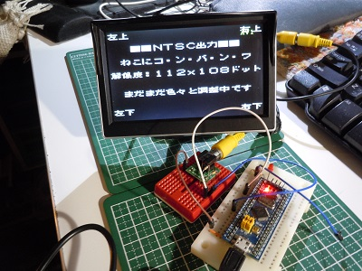
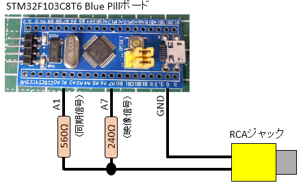
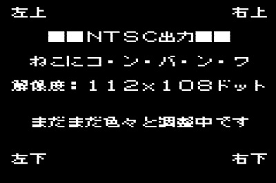
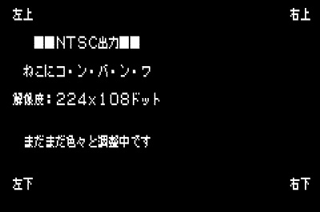
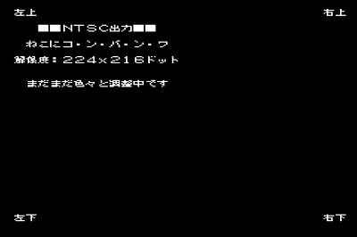
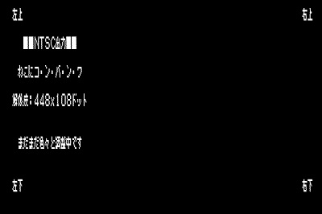
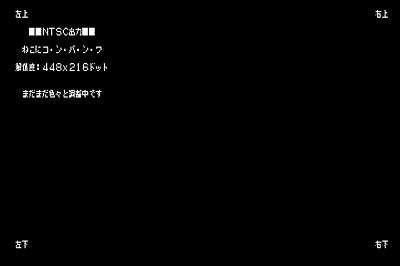

# Arduino STM32 NTSCビデオ出力ラブラリ
## 概要
Arduino STM32環境にて利用可能なNTSCビデオ出力ドライバライブラリです.  
STM32F103x系マイコン搭載ボードにてNTSCビデオ出力を行うことが出来ます.  

**(注意)**  
本ライブラリには描画処理を行うAPI関数は含まれていません。  
描画処理を行うには別途上位のライブラリが必要となります。  

  

## ライブラリ名称
TNTSC (ヘッダーファイル TNTSC.h)  

## 仕様

- NTSCモノクロ2色(白・黒)表示  
- 表示解像度 14つのモード(システムクロック72MHz時・48MHz時合わせて)  
  横112×縦108ドット ～ 横512×縦216ドット)   
- ビデオ出力には下記リソースを利用します.  
  - SRAM ビデオ表示用フレームバッファ 1,512～12,096バイト(解像度による)  
  - タイマー Timer2  
  - SPI1 or SPI2 (コンストラクタで指定可能、SPI1がデフォルト)  
  - DMA1 CH3  

## 回路図  
  
接続端子  
PA1: 同期信号  
PA7: 映像信号(SPIにSPI1を利用した場合)  
※SPIにSPI2を利用する場合、映像信号出力ピンはPB15となります.  

## 必要部品  
- STM32F103xマイコンボード Blue Pill(STMF103C8T6搭載)  
- 560Ω 抵抗  
- 240Ω 抵抗  
- RCAジャック端子(NTSC対応モニターに接続)  

## インストール  
TNTSCフォルダを各自のArduino STM32インストール先のライブラリ用フォルダに配置する.  
=> インストールフォルダ\hardware\Arduino_STM32\STM32F1\libraries\  
に配置.

## サンプルスケッチの実行
### サンプルスケッチ：MisakiFontOur  
別途下記のライブラリのインストールが必要  
- Arduino-misakiUTF16
(Arduino用 美咲フォントライブラリ 教育漢字・内部フラッシュメモリ乗せ版)  
 https://github.com/Tamakichi/Arduino-misakiUTF16  
 
 **実行結果**   
 画面解像度を5秒間隔で変更してデモメッセージを表示します.  
    
    
   

## ライブラリリファレンス
ライブラリはクラスライブラリとして実装しています.  
NTSCビデオ出力の操作はグローバルオブジェクト変数TNTSCを利用します。  

### ヘッダーファイル
`#include <TNTSC.h>`  

### グローバルオブジェクト
`TNTSC`  

### 定数
画面解像度の指定  
・システムクロック 72MHz設定時  
```
#define SC_112x108  0 // 112x108
#define SC_224x108  1 // 224x108
#define SC_224x216  2 // 224x216
#define SC_448x108  3 // 448x108
#define SC_448x216  4 // 448x216
#define SC_DEFAULT  SC_224x216
```
・システムクロック 48MHz設定時  
```
#define SC_128x96   0 // 128x96
#define SC_256x96   1 // 256x96
#define SC_256x192  2 // 256x192
#define SC_512x96   3 // 512x96
#define SC_512x192  4 // 512x192
#define SC_128x108  5 // 128x108
#define SC_256x108  6 // 256x108
#define SC_256x216  7 // 256x216
#define SC_512x108  8 // 512x108
#define SC_512x216  9 // 512x216
#define SC_DEFAULT  SC_256x192
```

### パブリックメンバー関数
#### NTSCビデオ出力開始  

- 書式  
 `void begin(uint8_t mode=SC_DEFAULT,uint8_t spino = 1)`  

- 引数  
 mode :画面モード  
 spino:利用するSPIの指定 1:SPI2(デフォルト)、2:SPI2

- 戻り値  
 なし

- 説明  
 NTSCビデオ出力を開始します.  
 引数modeにて画面が解像度の指定が可能です。下記の指定が可能です.  
 
 システムクロック 72MHz時  
 
 mode|横ドット数|縦ドット数|使用メモリサイズ(バイト)
 :---:|--------:|--------:|---------------------:|
 SC_112x108|112|108|1,512
 SC_224x108|224|108|3,024
 SC_224x216|224|216|6,048
 SC_448x108|448|108|6,048
 SC_448x216|448|216|12,096
 SC_DEFAULT|224|216|6,048

 システムクロック 48MHz時  
 
 mode|横ドット数|縦ドット数|使用メモリサイズ(バイト)
 :---:|--------:|--------:|---------------------:|
 SC_128x96|128|96|1,536
 SC_256x96|256|96|3,072
 SC_256x192|256|192|6,144
 SC_512x96|512|96|6,144
 SC_512x192|512|192|12,288
 SC_128x108|128|108|1,728
 SC_256x108|256|108|3,456
 SC_256x216|256|216|6,912
 SC_512x108|512|108|6,912
 SC_512x216|512|216|13,824
 SC_DEFAULT|256|192|6,144

 指定した解像度に応じた表示用フレームバッファが動的に確保されます.  
 
#### NTSCビデオ出力終了

- 書式  
 `void end()`  

- 引数  
 なし  

- 戻り値  
 なし

- 説明  
 NTSCビデオ出力を終了します.  
 表示用フレームバッファ、およびタイマー割り込み等の資源を開放します.  
 
#### NTSCビデオ出力用フレームバッファ先頭アドレス取得

- 書式  
 `uint8_t* VRAM()`  

- 引数  
 なし  

- 戻り値  
 フレームバッファ先頭アドレス  

- 説明  
 NTSCビデオ出力用フレームバッファ先頭アドレスを取得します.  
 フレームバッファのバイトデータ内の1ビットは画面上の1ドットに対応しています.  
 1バイト内のビット並びは上位が左、下位が右となります.  
 
 画面モードが224x216ドットの場合のフレームバッファ構成  
   
 
 取得したフレームバッファアドレスを利用してフレームバッファに直接データを  
 書き込むことで任意の表示を行うことが出来ます.  
 
#### 画面クリア

- 書式  
 `void cls()`  

- 引数  
 なし  

- 戻り値  
 なし  

- 説明  
 フレームバッファを初期化し、画面表示をクリアします.  
 
#### フレーム表示待ち

- 書式  
 `void delay_frame(uint16_t x)`  

- 引数  
 uint16_t x : 表示待ち枚数    

- 戻り値  
 なし  

- 説明  
 指定したフレーム数の画面が表示されるまで時間待ちを行います.  
 画面の表示内容を高速に更新する場合、最低1フレーム分の表示待ちを行うことで  
 チラつきにない更新を行うことが出来ます.  
 1フレームは約1/60秒(16.7ミリ秒)に相当します.  

#### 画面横ドット数の取得

- 書式  
 `uint16_t width()`  

- 引数
 なし

- 戻り値  
 画面 横ドット数
 
- 説明  
 現在の画面解像度の横ドット数を返します.
 
#### 画面縦ドット数の取得

- 書式  
 `uint16_t height()`  

- 引数
 なし

- 戻り値  
 画面 縦ドット数
 
- 説明  
 現在の画面解像度の縦ドット数を返します.
 
#### 表示用フレームバッファ利用サイズの取得

- 書式  
 `uint16_t vram_size()`  

- 引数
 なし

- 戻り値  
 表示用フレームバッファ利用サイズ（バイト）
 
- 説明  
 現在の画面解像度の表示用フレームバッファ利用サイズを返します.

#### 画面モードの取得

- 書式  
 `uint16_t () screen()`

- 引数
 なし

- 戻り値  
 画面モード(0～4)
 
- 説明  
 現在の画面モードを返します.
  

#### サンプルスケッチ
 
```
#include <TNTSC.h>
#include <misakiUTF16.h>  // 美咲フォントライブラリ
   
// フォント描画
void drawFont(int x, int y, uint8_t* font) {
  uint8_t* ptr = &TNTSC.VRAM()[y*(TNTSC.width()/8)*8+x];
  for (int i=0; i<8; i++) {
    *ptr = *font;
    ptr+=(TNTSC.width()/8);
    font++;
  }
}

// 文字列描画
void drawText(int x, int y, char* str) {
  uint8_t  fnt[8];
  while(*str) {
    if (x>=(TNTSC.width()/8))
      break;
    if (! (str = getFontData(fnt, str, true)) )  {
         Serial.println("Error"); 
         break;
    }
    drawFont(x,y ,fnt);
    x++;
  }  
}

void setup(){

}

void loop(){
  char str[32];
  for (uint8_t i = 0; i <=4; i++) {
    TNTSC.begin(i);
  
    // 画面表示
    TNTSC.cls();
    drawText(0, 0,"左上");drawText((TNTSC.width()/8)-2, 0,"右上");
    drawText(0,(TNTSC.height()/8)-1,"左下");drawText((TNTSC.width()/8)-2,(TNTSC.height()/8)-1,"右下");
    drawText(0,2,"　　■■ＮＴＳＣ出力■■　　");
    drawText(0,4,"　ねこにコ・ン・バ・ン・ワ　");

    sprintf(str, "解像度：%dx%dドット", TNTSC.width(), TNTSC.height());
    drawText(0,6, str);
    drawText(0,9,"　まだまだ色々と調整中です　");

    delay(5000);   
    TNTSC.end();
  }  
}
```
